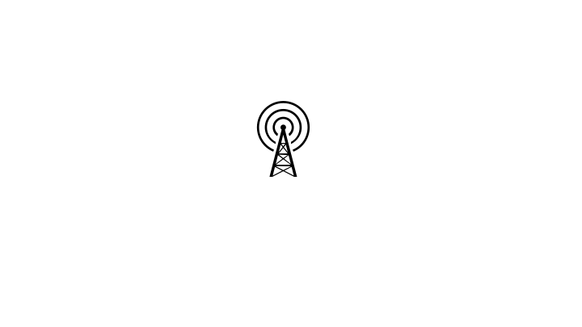
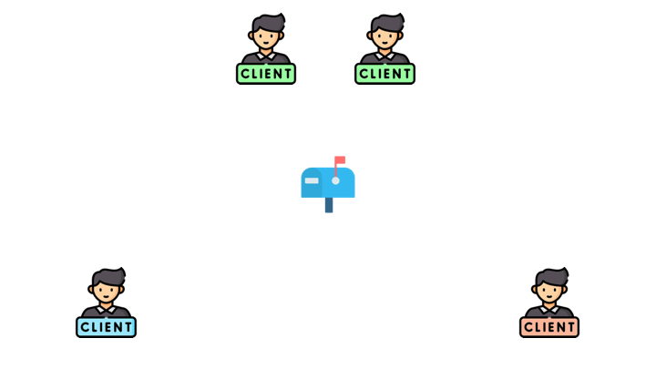
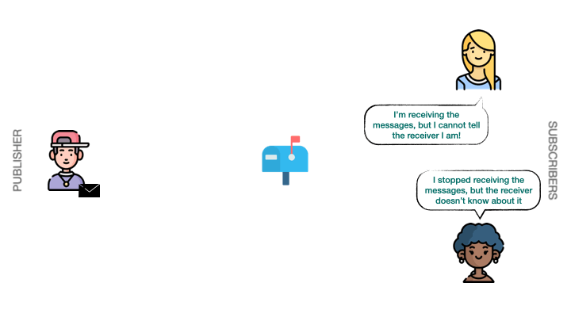

Pub/Sub 는 Publish/Subscribe 의 약자이다.

컴퓨터 프로그래밍 패턴 중 하나로, 애플리케이션의 한 구성 요소에서 다른 구성 요소 하나 또는 여러 개로 메시지를 보낼 수 있도록 허용하는데, 이러한 구성 요소는 서로 직접 연결되거나 직접적인 관계가 없다.

Publisher ↔ Subscriber 는 서로 누구인지 알 필요가 없다. Publisher는 메시지를 전송하고, Subscriber는 메시지를 받기만 하면 된다.

Redis 에서 클라이언트는 채널(Channel)에 메시지를 게시할 수 있고, 다른 클라이언트는 해당 채널을 구독(Subscribe)하여 메시지를 받을 수 있다.

Redis Pub/Sub은 동기식이기 때문에, 메시지가 전달되려면 Publisher ↔ Subscriber 가 동시에 연결되어있어야한다. 만약 연결이 끊어져서 메시지를 받지 못했다면, **놓친 메시지를 수신하지도 못하고 알림을 받지도 못한다.**

### Fire & Forget

Fire & Forget은 구독자가 메시지를 수신했다는 명시적 확인을 기대하지 않고 메시지를 보내는 메시징 패턴이다. 발신자는 구독자가 메시지를 수신했는지 여부와 관계없이 다음 작업으로 넘어간다.

**References**

- [Understanding Pub/Sub in Redis](https://medium.com/redis-with-raphael-de-lio/understanding-pub-sub-in-redis-18278440c2a9)
