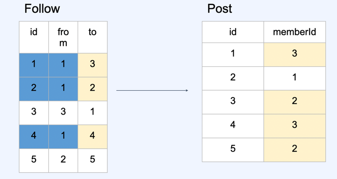
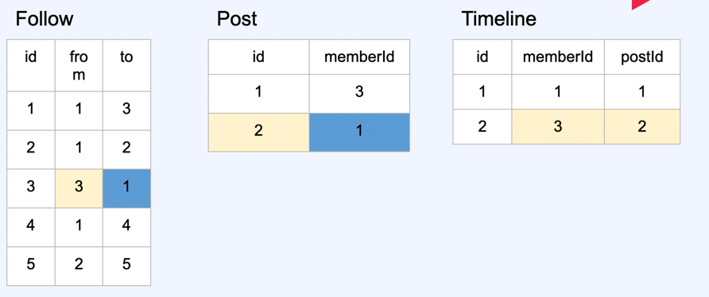

# 2장 주변 친구

## 도입

1장 근접성 서비스와의 차이는 **위치 정보의 정적, 동적 특성이다.**

## 1단계 : 문제 이해 및 설계 범위 설정

1. 지리 데이터의 경우 범위를 제한한다.
2. 거리 계산의 방법을 정의한다. (직선거리, 실제거리)
3. 총 사용자 수, 활성 사용자 수를 정의한다.
4. 데이터 일관성 여부를 확인한다.
5. 서비스의 정책을 확인한다.

### 기능 요구사항

- 모바일 앱 서비스로서 사용자는 주변 친구 목록, 거리, 갱신 시각을 확인할 수 있다.
- 친구 목록 및 이에 따른 지리 데이터는 갱신되어야 한다. (동적 특성)

### 비기능 요구사항

- 낮은 지연 시간 : 잦은 갱신을 필요로 하므로, 낮은 Latency 보장
- 안정성 : 지리 정보의 경우 유실을 허용
- 결과적 일관성 : 갱신 데이터 및 복제를 하므로 어느정도의 비일관성은 허용

## 2단계 : 개략적 설계안 제시 및 동의 구하기

- 개략적 설계 
  - P2P, 공용 벡엔드
  - 로드 밸런서 : RESTful API, 웹소켓 서버의 분리
  - 데이터 베이스
    - 레디스 위치 정보 캐시 , Pub/Sub Server
    - 사용자, 위치 이동 이력 데이터 베이스

### Pub / Sub 패턴

- 메세지 모델 중의 하나로 발행(Publish)과 구독(Subscribe) 역할로 개념화 한 형태
- 발행자와 구독자는 서로에 대한 정보 없이 특정 주제 (토픽 or 채널) 매개로 송수신

- 메세지 미들웨어의 장점
  - 비동기 
  - 낮은 결합도 : Pub - Sub 직접 의존하지 않는다.
  - 예 : Kafka, RabbitMQ ... 

- Redis Pub / Sub 특징

  - 메세지가 큐에 저장되지 않는다.
  - 분산처리 개념이 없다. ( Kafka Consumer Group )
  - 메세지 발행 시 Push 방식으로 Subscriber 전송
  - Subscribe 늘어나면, 성능 저하

- Redis Pub / Sub 유즈 케이스

    - 실시간으로, 빠르게 전송되어야 하는 메시지
    - 메세지 유실 허용되는 경우
    - 데이터 전송 패턴 중, 최대 1회 전송 패턴이 적합한 경우
    - Subscriber 다양성, 유동성 특징을 갖는 경우

  
- API 설계

1. 주기적인 위치 정보 갱신 (서버 API) (Post)
2. 클라이언트가 갱신된 친구 위치를 수신하는 데 사용할 API (Get)
3. 웹소켓 초기화 API (Post)
4. 새 친구 구독 API (Post)
5. 구독 해지 API (Delete)

- 데이터 모델

**위치 정보 캐시**

위치 정보 캐시는 관계형 데이터 베이스 대신 `Redis` 사용하는 이유?

1. 읽기 및 쓰기 연산 속도 - 위치 정보는 30초마다 갱신.
2. 데이터 영속성을 보장하지 않아도 된다. - 삭제되거나, 없어도 30초 뒤에 갱신
3. TTL : 일정 시간이 지나면 키가 자동으로 삭제되는 TTL

**위치 이동 이력 데이터베이스**

- 카산드라 

## 3단계 : 상세 설계 

#### 규모 문제를 해결 하기 위한 설계

얼마나 많은 레디스 Pub / Sub 필요한지 계산

- 메모리 사용량, CPU 사용량을 고려하여 계산

분산 레디스 Pub / Sub Server Cluster

- 서비스 탐색 컴포넌트의 도입 : etcd, ZooKeeper
  - 이번 설계에서 사용하는 기능 2가지 - 어디에 데이터를 저장했는지 기록(1번)하고, 해당 데이터를 적절하게 연결(2번)하는 기능 
  1. 가용 서버 목록 유지하는 기능 및 해당 목록을 갱신하는 데 필요한 API ( 해시링 )
  2. 클라이언트(본 설계안의 경우에는 웹소켓 서버)로 하여금 '값'에 명시된 레디스 펍/섭에서 변경 내역 구독할 수 있도록 하는 기능

해시 링 (안정 해시)

**친구가 많은 사용자**

- Fan Out On Read(Pull Model) vs Fan Out On Write(Push Model) 
- 페이스북 (시간 복잡도 ) vs X (공간 복잡도)

**Pull Model**

**Push Model**

## 4단계 : 마무리

핵심 컴포넌트 - 웹소켓, 레디스, 레디스 펍/섭

대용량 트래픽을 고려한 설계 시 고려해야 할 사항

1. RESTful API 서버 - 로드 밸런서
2. 웹소켓 서버 
3. 데이터 계층 - 사용자 정보(RDB), 위치 정보 캐시(레디스), 위치 이동 이력(카산드라)
4. 레디스 펍/섭 클러스터 - 장애 대응 및 운영 고려
5. 레디스 펍/섭 서버의 대안 - 언랭

