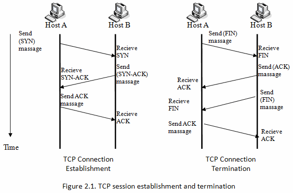

### HTTP Keep-Alive

HTTP/1.1 에서 적용 되었고, 클라이언트와 서버 간의 연결을 일정 시간 동안 유지시켜 여러 요청을 하나의 연결에서 처리할 수 있게 해주는 HTTP 프로토콜의 기능입니다.

TCP Connection 을 Close 하지 않고 재사용 하여 Connection을 유지하는 경우를 **_Persistent Connection_** 이라고 표현합니다.

- 매 요청마다 3-way handshake ❌, 4-way handshake ❌
  - 네트워크 혼잡 감소
  - 네트워크 비용 감소
  - Latency 감소

HTTP/1.1 이후부터는 기본적으로 모든 연결이 Keep-Alive 방식으로 동작하고 있다고 합니다.

HTTP/2 이후부터는 **_멀티플렉싱_** 이라는 방식을 지원하기 시작했고, Keep-Alive 헤더가 필요 없다고 합니다. (기본적으로 Persistent Connection을 지원함)

**Keep-Alive ↔️ Multiplexing 의 간단한 차이점**

- Keep-Alive: 한번에 하나의 요청을 처리합니다. 여러 요청을 순차적으로 보내는 방식으로, 응답이 차례대로 도착해야 하는 제약이 있습니다. 따라서 하나의 요청이 지연되면 뒤따르는 요청들도 지연되는 문제가 발생할 수 있습니다.

- Multiplexing: 각각의 요청과 응답을 개별적인 스트림에서 처리하며, 서로 독립적으로 전송될 수 있습니다.

_(p87)_

### CDN

**_CDN(Content Delivery Network)_** 은 전 세계에 분산된 서버 네트워크를 통해 사용자에게 웹 콘텐츠를 빠르게 제공하는 기술입니다. 왜냐하면 CDN은 사용자와 가장 가까운 서버에서 콘텐츠를 제공함으로써, 데이터 전송 시간을 단축하고 웹 페이지 로딩 속도를 개선하기 때문입니다.

**_PoP(Point of Presense)_** 란 자주 요청되는 콘텐츠(이미지, 동영상, CSS, JS 등)을 캐싱하여 사용자에게 빠르게 제공합니다. 이렇게 하면 원본 서버의 부하가 줄어들어서 사용자의 경험이 개선됩니다. 추가로 DDoS 공격 같은 네트워크 공격을 분산시키고 차단하는 데 도움을 줄 수 있다고 합니다.

_(p90)_
